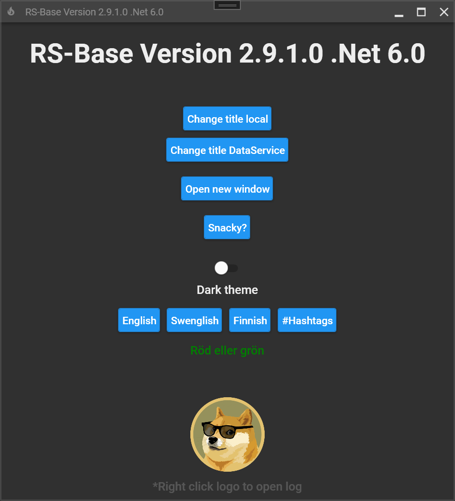

 

> An awesome boilerplate template for building beautiful MVVM WPF .Net Core and Framework applications.
> It comes preconfigured with MVVM-light, Serilog, Localization, MaterialDesignForXAML and a nice architectural structure.
> Every release has a Project and an Item template for Visual Studio to easily get started.

---
### Clone
- Clone this repo to your local machine using `https://github.com/Aangbaeck/RS-Base.git`

## Setup

### Developer Setup
You need to have .Net Core 3.1, Framework 4.7.2 & Visual Studio 2019 installed

When creating project templates - use the whole project "RS-Base Clean""
When creating the item template for windows - use the EmptyWindowV.xaml under "RS-Base Example"

### User Setup
* Download latest release.
* Close Visual Studio.
* Copy "RS-Base Vx.zip" and put in "%USERPROFILE%\Documents\Visual Studio 2019\Templates\ProjectTemplates".
* Copy "RS-Base Window Vx.zip" and "RS-Base TabControlWindow Vx.zip" and put in "%USERPROFILE%\Documents\Visual Studio 2019\Templates\ItemTemplates".

When creating a new Project or Item in Visual Studiop these template will show up.

You need to have .Net Core 3.1 or Framework 4.7.2 installed.
If the references gives you any troubles: Run the command "Update-Package -Reinstall" (without "") in the Package-Manager console

The NuGet-package RS-StandardComponents is published on NuGet [Nuget Gallery](https://www.nuget.org/packages/RS-StandardComponents)

Tips:
* Use [LogExpert](https://github.com/zarunbal/LogExpert) to read the logfiles. LogExpert can tail the logfiles very efficient.
* Use [ResX Manager](https://github.com/dotnet/ResXResourceManager) for handling the Resource files. It's a very convenient tool. It's both availible as a standalone app and a extension to Visual Studio.
* There is a compiled version of [MaterialDesignInXAML](https://github.com/MaterialDesignInXAML/MaterialDesignInXamlToolkit/releases) to be used as a cheat set to see what types of controls are availible

---

## Featuring
- [MVVM-Light](https://github.com/lbugnion/mvvmlight)
- [MaterialDesignInXamlToolkit](https://github.com/MaterialDesignInXAML/MaterialDesignInXamlToolkit)
- [MaterialDesignExtensions](https://github.com/spiegelp/MaterialDesignExtensions)
- [Serilog](https://github.com/serilog/serilog)
- [Localization Infralution](https://www.codeproject.com/Articles/35159/WPF-Localization-Using-RESX-Files)

---

## Contributing
#### Step 1
- **Option 1**
    - 🍴 Fork this repo!
- **Option 2**
    - 👯 Clone this repo to your local machine using `https://github.com/Aangbaeck/RS-Base.git`
#### Step 2
- **HACK AWAY!** 🔨🔨🔨

#### Step 3
- ✅ Check that everything works
- 🔃 Create a new pull request.

---
## Roadmap
* Add mahapps icon package for even more icons! + Example!
* Extend the example app more with a lot more comments.
* Add automatic template creation when building project.
---

## License
 
- **[MIT license](http://opensource.org/licenses/mit-license.php)**
- Copyright 2020 © [RemaSawco](https://remasawco.se/)
